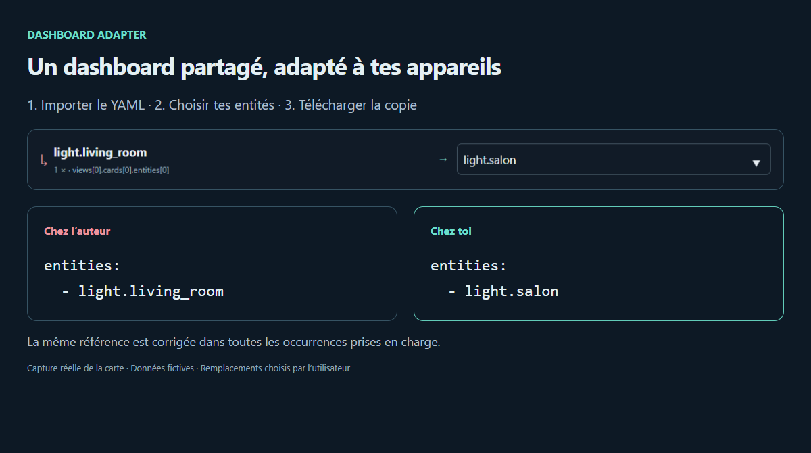

# Dashboard Adapter

**[Readme English](README.md)**

Si vous voulez essayer une démo, testez-la ici : **[Démo](https://skytyphon.github.io/dashboard-adapter/fr/)**.

Si vous aimez mon travail :

[](https://buymeacoffee.com/skytyphoni)

[](https://my.home-assistant.io/redirect/hacs_repository/?owner=SkyTyphon&repository=dashboard-adapter&category=plugin)

**Reprends un dashboard Home Assistant partagé avec tes propres appareils.**

Tu télécharges un dashboard qui utilise `light.living_room`, alors que ta lumière s’appelle `light.salon` ? Dashboard Adapter repère cette référence absente, te laisse choisir ta lumière et télécharge une copie adaptée.



*La vraie carte fonctionne avec des appareils fictifs. L’image montre le même exemple avant et après les remplacements choisis.*

## Ce que fait la carte

1. Importe un dashboard complet en YAML ou JSON.
2. Affiche les entités absentes, les états indisponibles et les cartes personnalisées nécessaires.
3. Te laisse choisir une entité existante pour chaque référence absente.
4. Compare les fichiers original et adapté, puis télécharge une copie.

C’est une **carte Lovelace**, distribuée dans HACS en catégorie **Dashboard**. Elle fonctionne dans le navigateur, sans Python, et n’enregistre aucune modification dans Home Assistant. Tu importes toi-même la copie téléchargée.

## Essaie avant d’installer

Ouvre la [démo française](https://skytyphon.github.io/dashboard-adapter/fr/). Clique sur **Appliquer des exemples**, puis compare les deux panneaux YAML. Clique sur **Télécharger** pour récupérer l’exemple adapté. Les appareils sont fictifs et la démo ne se connecte pas à ton Home Assistant.

La [démo anglaise](https://skytyphon.github.io/dashboard-adapter/en/) propose les mêmes fonctions. Chaque page permet de changer de langue et de thème clair/sombre.

## Installation avec HACS

Clique sur **[Open HACS repository](https://my.home-assistant.io/redirect/hacs_repository/?owner=SkyTyphon&repository=dashboard-adapter&category=plugin)** pour ouvrir ce dépôt dans ton Home Assistant. HACS doit déjà être installé. Au premier accès, My Home Assistant demande l’adresse de ton instance.

Tu peux aussi l’ajouter manuellement :

1. Dans HACS, ouvre **Dépôts personnalisés**.
2. Ajoute `https://github.com/SkyTyphon/dashboard-adapter` en catégorie **Dashboard**.
3. Télécharge Dashboard Adapter. Pour la bêta, active les préversions si HACS propose cette option.
4. Actualise Home Assistant, modifie un dashboard, ajoute une carte manuelle et colle :

```yaml
type: custom:dashboard-adapter-card
language: auto
```

`auto` suit la langue de ton interface Home Assistant. Sans champ `language`, le comportement est identique. Le français et l’anglais sont disponibles ; les autres langues utilisent l’anglais.

Si Home Assistant signale que la carte n’existe pas, vérifie que cette ressource est enregistrée comme **module JavaScript** :

```text
/hacsfiles/dashboard-adapter/dashboard-adapter.js
```

## Adapter ton dashboard

1. Exporte la configuration complète du dashboard source depuis son éditeur de configuration brute dans un fichier `.yaml`, `.yml` ou `.json`.
2. Clique sur **Importer un dashboard** ou dépose le fichier sur la carte.
3. Consulte **Dépendances**. Installe séparément les cartes personnalisées indiquées.
4. Ouvre **Correspondance des entités**. Choisis une suggestion ou saisis l’identifiant d’une entité existante du même domaine. Une lumière `light.*` doit être remplacée par une autre lumière `light.*`.
5. Ouvre **Aperçu de l’export** et vérifie les deux fichiers. Les références non résolues restent dans la copie exportée.
6. Clique sur **Télécharger**. Sauvegarde le dashboard de destination, puis importe la copie dans l’éditeur habituel de Home Assistant.

## Pour aller plus loin

### Réglage de la langue

| Réglage | Comportement |
| --- | --- |
| `language: auto` | Suit la langue de l’interface Home Assistant de l’utilisateur connecté. |
| `language: fr` | Force le français. |
| `language: en` | Force l’anglais. |
| Aucun champ `language` | Identique à `auto`. |

Pour la version française de la carte :

```yaml
type: custom:dashboard-adapter-card
language: fr
```

Les deux versions utilisent la même ressource JavaScript. Les identifiants d’entités et les noms de champs YAML restent identiques dans les deux langues.

Exemples prêts à copier : [langue automatique](examples/card.auto.yaml), [carte française](examples/card.fr.yaml), [carte anglaise](examples/card.en.yaml).

### Installation manuelle

Copie [`dist/dashboard-adapter.js`](dist/dashboard-adapter.js) dans `<config>/www/dashboard-adapter.js`. Enregistre `/local/dashboard-adapter.js` comme ressource **module JavaScript**, actualise le navigateur et ajoute la carte avec la configuration ci-dessus.

### Ce qui est vérifié et remplacé

Champs explicites pris en charge : `entity`, `entity_id` (y compris les listes), `camera_image`, `default_entity_id`, ainsi que les chaînes dans les tableaux `entities` et `entity_ids`. Les cartes imbriquées et les cibles d’actions sont parcourues. Les suggestions utilisent le domaine et les mots de l’identifiant ; elles ne garantissent pas que l’appareil proposé corresponde au bon usage.

La présence d’une entité est vérifiée dans les états accessibles à la session frontend Home Assistant. Un état absent ne prouve pas que l’entité a été supprimée ; vérifie **Outils de développement → États** si nécessaire. Les états `unknown` et `unavailable` sont distingués des identifiants absents.

La carte liste les types `custom:*`, sans confirmer l’installation de leurs ressources. Les modèles doivent être vérifiés manuellement : les identifiants intégrés dans Jinja, JavaScript, Markdown, CSS ou des champs propres à certaines cartes ne sont pas réécrits. Les directives YAML `!include`, les autres tags Home Assistant et les dashboards répartis en plusieurs fichiers ne sont pas pris en charge.

### Fichiers, confidentialité et limites

Le fichier doit contenir un tableau `views` à la racine. La limite est de 2 000 000 caractères, soit environ 2 Mo pour du texte ASCII. Les commentaires YAML sont conservés lorsque possible ; la mise en forme peut changer. Le JSON exporté utilise deux espaces d’indentation. Les fichiers restent dans le navigateur jusqu’au téléchargement ; la carte ne les envoie ni ne les conserve.

Vérifie les URL privées ou les jetons présents avant de partager un export : cet outil ne les anonymise pas.

### Dépannage

| Problème | Vérification |
| --- | --- |
| Carte introuvable | Ressource JavaScript enregistrée, fichier téléchargé, navigateur actualisé. |
| Import refusé | Dashboard complet avec `views` à la racine ; YAML/JSON valide ; aucune clé en double ni tag non pris en charge. |
| Remplacement refusé | Entité existante et du même domaine que la référence source. |
| Mauvaise langue | Utilise `auto` pour suivre Home Assistant, ou force `fr` / `en`. |

### Développement

`npm ci` puis `npm run check` exécutent les tests unitaires, la compilation et le contrôle de l’artefact. `npm run build:demo` génère les deux démos. Lance `node scripts/preview-server.mjs`, puis ouvre `/demo/fr/index.html` ou `/demo/en/index.html` sur le serveur local.

`npm run test:browser` vérifie les interactions réelles, l’export, les traductions et le rendu mobile avec Chrome installé. Définis `CHROME_PATH` si Chrome se trouve ailleurs.

## État du projet et soutien

Bêta publique. Les tests automatisés, la démo navigateur et la validation du dépôt HACS passent. L’installation sur une instance Home Assistant réelle reste à vérifier. [Signale un problème](https://github.com/SkyTyphon/dashboard-adapter/issues) avec un exemple anonymisé.

Licence MIT. Si le projet t’aide, tu peux [m’offrir un café](https://buymeacoffee.com/skytyphoni).
