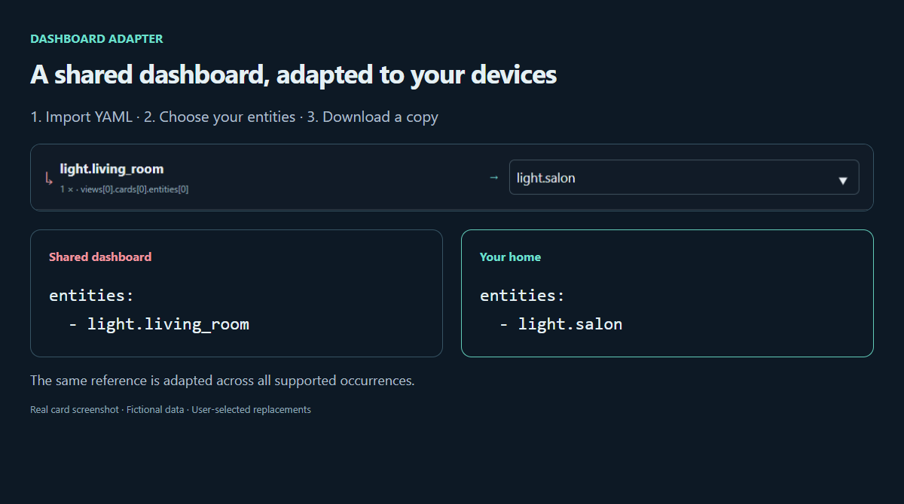

# Dashboard Adapter

**[Readme Français](README.fr.md)**

If you want to try a demo, test it here: **[Demo](https://skytyphon.github.io/dashboard-adapter/en/)**.

If you like my work:

[](https://buymeacoffee.com/skytyphoni)

[](https://my.home-assistant.io/redirect/hacs_repository/?owner=SkyTyphon&repository=dashboard-adapter&category=plugin)

**Reuse a shared Home Assistant dashboard with your own devices.**

Downloaded a dashboard that uses `light.living_room`, while yours is called `light.salon`? Dashboard Adapter finds that missing reference, lets you choose your light, and downloads an adapted copy.



*Actual card running with fictional devices. The image shows the same sample before and after selected replacements.*

## Table of contents

1. [What it does](#what-it-does)
2. [Features](#features)
3. [Try it first](#try-it-first)
4. [Requirements](#requirements)
5. [Installation](#installation)
   - [With HACS (recommended)](#with-hacs-recommended)
   - [Manual HACS custom repository](#manual-hacs-custom-repository)
   - [Manual installation without HACS](#manual-installation-without-hacs)
   - [Add the card to a dashboard](#add-the-card-to-a-dashboard)
6. [Adapt your dashboard](#adapt-your-dashboard)
   - [Step by step](#step-by-step)
   - [Interface overview](#interface-overview)
7. [Configuration](#configuration)
   - [Card options](#card-options)
   - [Language settings](#language-settings)
   - [Ready-to-copy examples](#ready-to-copy-examples)
8. [How it works](#how-it-works)
   - [What is inspected and replaced](#what-is-inspected-and-replaced)
   - [Entity status](#entity-status)
   - [Replacement suggestions](#replacement-suggestions)
   - [Custom cards and templates](#custom-cards-and-templates)
   - [Exported file](#exported-file)
9. [Files, privacy and limits](#files-privacy-and-limits)
10. [Troubleshooting](#troubleshooting)
11. [FAQ](#faq)
12. [Development](#development)
13. [Contributing](#contributing)
14. [Status and support](#status-and-support)

## What it does

1. Import a complete dashboard as YAML or JSON.
2. See missing entities, unavailable states and required custom card types.
3. Choose an existing replacement for each missing entity.
4. Compare the original and adapted files, then download a copy.

This is a **Lovelace card**, distributed through HACS as a **Dashboard** plugin. It runs in your browser, contains no Python and never saves changes to Home Assistant. You import the downloaded copy yourself.

## Features

- **YAML and JSON import**, by file picker or drag and drop.
- **Dependency inventory**: every entity reference, its location in the dashboard, and every `custom:*` card type.
- **Compatibility score**: share of referenced entities that exist and are available in your Home Assistant.
- **Entity mapping** with same-domain suggestions taken from your own entities.
- **Side-by-side preview** of the original and adapted files before download.
- **Safe rewrite**: only explicit entity fields change; YAML comments are preserved where possible.
- **Template detection**: Jinja expressions (`{{ }}` and ``) are counted so you can review them manually.
- **English and French interface**, following the Home Assistant language automatically.
- **Built-in demo mode** with fictional entities, available directly in the card.
- **Fully local**: no upload, no backend, no change to your Home Assistant configuration.
- **Responsive layout** for desktop, tablet and mobile, in light and dark themes.

## Try it first

Open the [English demo](https://skytyphon.github.io/dashboard-adapter/en/). Click **Apply example mappings**, then compare the two YAML panels. Click **Download** to get the adapted sample. The demo uses fictional devices and has no connection to your Home Assistant.

The [French demo](https://skytyphon.github.io/dashboard-adapter/fr/) offers the same features. Each page has a language switch and a light/dark theme switch.

Once installed, the card also has a **Try demo** button that loads the same fictional dashboard without touching your entities.

## Requirements

- Home Assistant with dashboards (Lovelace) and permission to edit a dashboard.
- [HACS](https://hacs.xyz/) for the recommended installation. Manual installation works without it.
- A recent desktop or mobile browser.
- The complete source dashboard as a `.yaml`, `.yml` or `.json` file.

## Installation

### With HACS (recommended)

Click **[Open HACS repository](https://my.home-assistant.io/redirect/hacs_repository/?owner=SkyTyphon&repository=dashboard-adapter&category=plugin)** to open this repository in your Home Assistant. HACS must already be installed. On your first visit, My Home Assistant asks for your instance address.

Then click **Download** in HACS. For the beta, enable prerelease versions if HACS offers that option. Refresh your browser when the download is finished.

### Manual HACS custom repository

1. In HACS, open **Custom repositories**.
2. Add `https://github.com/SkyTyphon/dashboard-adapter` with category **Dashboard**.
3. Download Dashboard Adapter. For the beta, enable prerelease versions if HACS offers that option.
4. Refresh Home Assistant in your browser.

HACS normally registers the resource automatically. If Home Assistant reports “Custom element doesn't exist”, check that this resource is registered as a **JavaScript module** in **Settings → Dashboards → Resources**:

```text
/hacsfiles/dashboard-adapter/dashboard-adapter.js
```

### Manual installation without HACS

1. Copy [`dist/dashboard-adapter.js`](dist/dashboard-adapter.js) into `<config>/www/dashboard-adapter.js`.
2. In **Settings → Dashboards → Resources**, register `/local/dashboard-adapter.js` as a **JavaScript module**.
3. Refresh the browser, ideally with the cache cleared.

Repeat the copy when you update to a new version.

### Add the card to a dashboard

Edit a dashboard, add a card and search for **Dashboard Adapter** in the card picker, or add a **Manual** card and paste:

```yaml
type: custom:dashboard-adapter-card
language: auto
```

The card works best on a wide view, for example a panel or sections view: it occupies the full grid width by default.

## Adapt your dashboard

### Step by step

1. Export the complete source dashboard from its raw configuration editor to a `.yaml`, `.yml` or `.json` file.
2. Click **Import dashboard** or drop the file onto the card.
3. Read **Dependencies**. Install listed custom cards separately.
4. Open **Entity mapping**. Choose a suggestion or type an existing entity ID of the same domain. For example, replace a `light.*` entity with another `light.*` entity.
5. Open **Export preview** and check both files. Unresolved references remain visible in the exported copy.
6. Click **Download**. Back up the destination dashboard, then import the adapted configuration through Home Assistant's normal editor.

To import the result, open the destination dashboard, choose **Edit dashboard → ⋮ → Raw configuration editor**, replace the content with the downloaded file and save. Keep a copy of the previous configuration first.

### Interface overview

| Area | Content |
| --- | --- |
| Toolbar | File name, **Import dashboard**, **Try demo** and **Clear** buttons. |
| Summary | **Compatibility** score, number of views, cards and entities, plus Ready / Missing / Unavailable counters. |
| **Dependencies** tab | Every referenced entity with its status and location, detected custom cards and template expressions. |
| **Entity mapping** tab | One row per missing entity, with a replacement field and suggestions. The tab title shows resolved / missing. |
| **Export preview** tab | Original and adapted files side by side, number of changes, warning for unresolved references and **Download** button. |

Locations use a readable path such as `views[0].cards[2].entity`, so you can find each reference in the source file.

## Configuration

### Card options

- **`type`** (required): `custom:dashboard-adapter-card`.
- **`language`** (optional): `auto` (default), `en` or `fr`. Interface language. Any other value is rejected by the card editor.

The card has no other options: everything else happens inside the card.

### Language settings

| Setting | Behavior |
| --- | --- |
| `language: auto` | Follows the language of the current Home Assistant user interface. |
| `language: en` | Forces English. |
| `language: fr` | Forces French. |
| No `language` field | Same as `auto`. |

`auto` uses French for any French Home Assistant language and English for all other languages. For the English version of the card:

```yaml
type: custom:dashboard-adapter-card
language: en
```

The same JavaScript resource supplies both versions. Entity IDs and YAML field names stay unchanged across languages.

### Ready-to-copy examples

- [Automatic language](examples/card.auto.yaml)
- [English card](examples/card.en.yaml)
- [French card](examples/card.fr.yaml)

## How it works

### What is inspected and replaced

Supported explicit fields: `entity`, `entity_id` (including lists), `camera_image`, `default_entity_id`, plus strings in `entities` and `entity_ids` arrays. Comma-separated entity IDs in these fields are handled individually. Nested cards, stacks, picture elements and action targets are traversed at any depth.

Example: in the snippet below, both `light.living_room` references are detected and replaced together.

```yaml
- type: button
  entity: light.living_room
  tap_action:
    action: perform-action
    perform_action: light.toggle
    target:
      entity_id:
        - light.living_room
```

Every occurrence of the same entity ID is replaced by the same choice.

### Entity status

| Status | Meaning |
| --- | --- |
| **Ready** | The entity exists and has a normal state. |
| **Unavailable** | The entity exists but its state is `unknown` or `unavailable`. It is not offered for mapping. |
| **Missing** | No state with this ID is visible to the current session. It can be mapped. |

Entity presence is checked against states available to the current Home Assistant frontend session. A missing state does not prove that an entity has been deleted; check **Developer Tools → States** if needed.

The **Compatibility** score is the number of Ready entities divided by the number of referenced entities.

### Replacement suggestions

Suggestions come from your own entities with the same domain, ranked by the words they share with the missing ID (for example `living`, `room`, `temperature`). Up to eight suggestions are shown. They are suggestions, not confirmed device matches: check that the proposed entity really plays the same role.

A replacement is refused if the entity does not exist or belongs to another domain.

### Custom cards and templates

The card lists `custom:*` types, but cannot confirm whether their resources are installed. Install them separately, usually through HACS.

Review template expressions manually: entity IDs inside Jinja, JavaScript, Markdown, CSS and arbitrary custom card fields are not rewritten. The number of fields containing Jinja is shown in **Dependencies**.

### Exported file

- The download keeps the source format and adds `-adapted` to the name, for example `my-dashboard-adapted.yaml`.
- YAML comments are preserved where possible, but formatting may change.
- JSON exports use two-space indentation.
- Unmapped entities are left as they were.

## Files, privacy and limits

Import requires a root `views` array and is limited to 2,000,000 characters (approximately 2 MB for ASCII text). YAML must be valid, without duplicate keys. Files stay in the browser until you download them; the card does not upload or persist them. Clearing the card or reloading the page discards the import and the chosen mappings.

Review private URLs or tokens in your source dashboard before sharing an export: this tool does not anonymize them.

Not supported:

- YAML `!include`, `!secret` and other Home Assistant YAML tags.
- Dashboards split across multiple files.
- Single cards or single views without the complete dashboard structure.
- Entity IDs inside templates or card-specific free text fields.
- Mapping to an entity of another domain.

## Troubleshooting

| Problem | What to check |
| --- | --- |
| Card not found / “Custom element doesn't exist” | JavaScript resource registered as a module, file downloaded, browser refreshed with cache cleared. |
| Import rejected | Complete dashboard with a root `views` array; valid YAML/JSON; no duplicate keys or unsupported tags; file under 2 MB. |
| Replacement rejected | Existing entity ID, same domain as the source reference. |
| No suggestion | No entity of the same domain exists, or you are in demo mode with fictional entities. Type the ID manually. |
| All entities shown as missing | The card is displayed outside Home Assistant or the session has no state access. Structure checks still work. |
| Unexpected language | Use `auto` to follow the Home Assistant user interface, or force `fr` / `en`. |
| Adapted dashboard still shows errors | Install the listed custom cards and review templates and card-specific fields manually. |

## FAQ

**Does the card change my Home Assistant configuration?**
No. It only reads entity states and produces a file. You decide whether to import it.

**Is my dashboard sent anywhere?**
No. The file is read and processed in your browser.

**Can I adapt a dashboard for someone else?**
Yes, but suggestions and availability checks use the entities of the Home Assistant instance where the card runs.

**Why is an entity marked unavailable and not missing?**
It exists in your instance but currently reports `unknown` or `unavailable`. Check the device or integration instead of replacing it.

**Does it work with YAML-mode dashboards?**
Yes, if you provide the complete configuration in one file without `!include` or other YAML tags.

## Development

Run `npm ci` and `npm run check` for unit tests, compilation and artifact checks. Run `npm run build:demo` to generate both demo pages. Serve locally with `node scripts/preview-server.mjs`; open `/demo/en/index.html` or `/demo/fr/index.html`.

| Command | Purpose |
| --- | --- |
| `npm test` | Unit tests for parsing, analysis and rewriting. |
| `npm run build` | Builds `dist/dashboard-adapter.js`. |
| `npm run check` | Tests, build and HACS artifact check. |
| `npm run build:demo` | Builds the English and French demo pages. |
| `npm run test:browser` | Real browser checks: desktop, mapping, download, French, light theme and mobile. |
| `npm run test:bilingual` | Language checks: forced and automatic language, export, localized errors and navigation. |

Browser tests use installed Chrome. Set `CHROME_PATH` if Chrome is elsewhere.

Source layout: `src/card.js` (card and interface), `src/dashboard.js` (parsing, analysis, suggestions and rewriting), `src/i18n.js` (translations), `src/styles.js`, `src/demo.js` (fictional demo data).

## Contributing

Issues and pull requests are welcome. Describe the Home Assistant version, dashboard structure, expected result and actual result. Remove private URLs, tokens, IP addresses and personal entity names from examples. See [CONTRIBUTING.md](CONTRIBUTING.md) and the [changelog](CHANGELOG.md).

## Status and support

Public beta. Automated tests, browser demo and HACS repository validation pass. Installation on a live Home Assistant instance remains to be verified. [Report a problem](https://github.com/SkyTyphon/dashboard-adapter/issues) with a sanitized example.

MIT license, see [LICENSE](LICENSE). If this project helps you, you can [buy me a coffee](https://buymeacoffee.com/skytyphoni).
