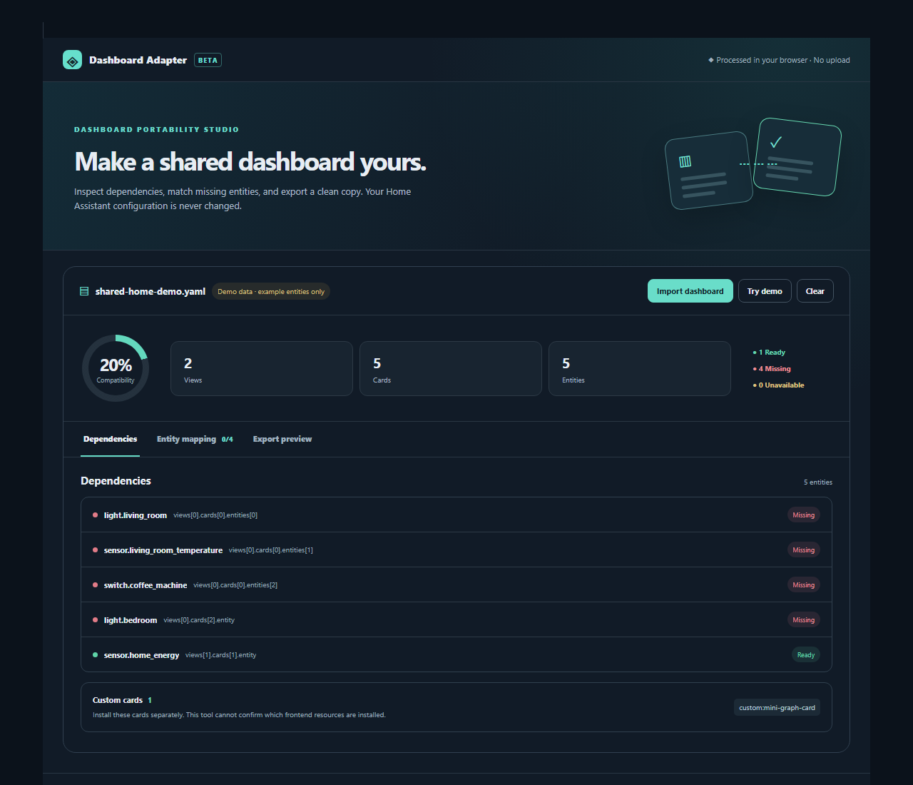

# Dashboard Adapter

**Turn a shared Home Assistant dashboard into one that fits your installation.**

Dashboard Adapter is a browser-only Lovelace card. Import a YAML or JSON dashboard, see missing and unavailable entities, map missing references to your own entities, review the result, and download a copy. It does not write to your Home Assistant configuration or send the imported file to a server.



> Screenshot: the real JavaScript card running in a local browser preview with fictional demo states. Home Assistant integration has not yet been validated on a live instance.

## Why this exists

Shared dashboards are often difficult to reuse because entity IDs and custom cards differ between homes. Linked Cards focuses on reusable, synchronized card templates and linked sections. Dashboard Adapter tackles the **whole imported dashboard**: inspect its dependencies, adapt explicit entity references, then export a reviewed copy. It does not implement linked templates or live synchronization.

## Features

- YAML and JSON dashboard import, local to your browser (2 MB maximum).
- Entity reference inventory across views and nested cards.
- Distinguishes missing IDs from `unavailable` / `unknown` states.
- Lists `custom:*` card types and flags template expressions for manual review.
- Same-domain entity suggestions; every replacement requires your choice.
- Rewrites only known entity fields, preserving YAML comments where possible.
- Side-by-side source and adapted export preview.
- English and French interface, responsive layout, theme variables, fictional demo.

## Install

This is a **HACS Dashboard plugin**, not a Home Assistant custom integration. It contains no Python.

Add `https://github.com/SkyTyphon/dashboard-adapter` under **HACS → Custom repositories → Dashboard**, install it, then add the card to a dashboard:

```yaml
type: custom:dashboard-adapter-card
```

For manual installation, copy [`dist/dashboard-adapter.js`](dist/dashboard-adapter.js) to `<config>/www/dashboard-adapter.js`, add `/local/dashboard-adapter.js` as a **JavaScript module** dashboard resource, then add the card above.

The card has no configuration. To force French:

```yaml
type: custom:dashboard-adapter-card
language: fr
```

## Use

1. On a Home Assistant dashboard, add Dashboard Adapter.
2. Click **Import dashboard** and select a `.yaml`, `.yml`, or `.json` file containing a top-level `views` array. Or click **Try demo**.
3. Review **Dependencies**. Install required custom cards yourself.
4. Open **Entity mapping**. Choose or type an existing entity ID of the same domain for each missing reference.
5. Open **Export preview**, inspect the result and download it.
6. Import the downloaded dashboard through Home Assistant's normal dashboard workflow. Keep a backup of the destination dashboard.

## What is checked

Known explicit fields: `entity`, `entity_id`, `camera_image`, `default_entity_id`, plus strings in `entities` and `entity_ids` arrays. Nested cards and action targets are traversed. Presence comes from the current frontend `hass.states`; a missing state is not always proof that an entity has been removed from Home Assistant.

The card **does not** rewrite entity IDs hidden in Jinja templates, JavaScript templates, Markdown, CSS, navigation paths, or arbitrary custom card fields. Template expressions are flagged. Custom card types are listed, but their installation is not verified. `!include`, other Home Assistant YAML tags, and dashboards split across files are not currently supported. YAML formatting may change on export, although comments are retained where the parser can preserve them.

## Privacy and safety

The imported dashboard is parsed in your browser only. No dashboard data is uploaded, saved by this card, or written to Home Assistant. Exporting creates a local download. Review the file before using it; a dashboard can contain private URLs, tokens, camera paths or other sensitive data that this card does not remove.

## Development

Requires Node.js. Run `npm ci`, then `npm run check`. `npm run check` runs unit tests, bundles the card, and checks the HACS artifact. Source lives in `src/`; `dist/dashboard-adapter.js` is the distributable file.

For a local UI preview, run `node scripts/preview-server.mjs` and open `http://127.0.0.1:4173/`. The preview uses fictional states. It is not an integration test inside Home Assistant.

## FAQ

**Why is an entity shown as missing when it exists?** The card checks the entity states available to the current frontend session. Refresh Home Assistant and confirm the ID is present in Developer Tools → States.

**Can I install a custom card from here?** No. The card identifies `custom:*` types but does not install resources.

**Will it change my current dashboard?** No. It only downloads an adapted file.

**Why did my template stay unchanged?** Rewriting template code without understanding its syntax would be unsafe. Review it manually.

## Troubleshooting

- **Card not found:** confirm the JavaScript resource was installed and refresh the browser cache.
- **Import rejected:** export the complete dashboard as YAML/JSON with a root `views` array. Resolve unsupported YAML tags or duplicate keys.
- **Replacement rejected:** use an entity ID already present in your Home Assistant states and in the same domain as the source ID.

## Roadmap

- **v1.1:** inspect additional standard dashboard dependencies and improve mapping suggestions.
- **v1.2:** optional read-only import from a dashboard available to the current Home Assistant user, if stable APIs permit.
- **v2.0:** guided compatibility reports for custom card schemas and resource availability, with explicit confidence levels.

## Project status

Public beta source. Unit tests, browser preview and CI passed; live Home Assistant and HACS installation are still to be tested before a tagged release. License: MIT.
